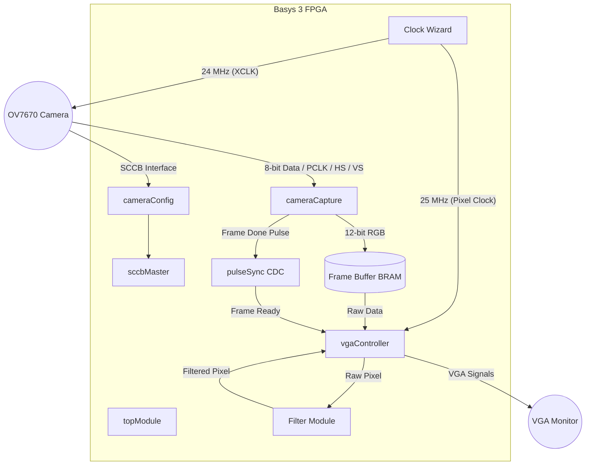

# Basys 3 OV7670 Video Pipeline

This repository contains a complete FPGA-based video pipeline that captures real-time video from an **OV7670 CMOS Camera** and displays it on a VGA monitor using a **Basys 3 (Artix-7)** development board.

The system features real-time image processing filters, robust SCCB configuration, and a fully verified testbench suite using **Cocotb**.

---

## 🏗 System Architecture

The project is designed with a modular architecture to handle the different clock domains (Camera Pixel Clock vs. VGA Clock) and provide a clean interface for image processing.



---

## 📂 Project Structure

```text
.
├── cocotb_sim           # Cocotb Python testbenches for all modules
│   ├── cameraCapture    # Pixel data capture logic verification
│   ├── cameraConfig     # SCCB register sequence verification
│   ├── filter           # Real-time image processing logic
│   ├── topModule        # System-level integration tests
│   └── ...              # Other module unit tests
├── project.srcs         # Vivado Source Files
│   ├── sources_1/new    # Verilog source code (.v)
│   ├── constrs_1        # XDC constraints for Basys 3
│   └── sources_1/ip     # Xilinx IP cores (Clock Wizard, BRAM)
├── OV7670.pdf           # Camera Sensor Datasheet
├── Basys3.pdf           # FPGA Board Documentation
└── SCCB.pdf             # SCCB Interface Specification
```

---

## ✨ Features

- **High Performance Capture**: Supports QVGA (320x240) resolution at real-time speeds.
- **Display Scaling**: Efficient pixel doubling (2x2) to display a 320x240 capture on a standard 640x480 VGA timing.
- **12-bit Color Path**: Full RGB444 color processing throughout the pipeline.
- **Real-time Filters**: Hardware-accelerated image processing controlled by physical switches:
  - **Switch [4]**: Color Inversion
  - **Switch [3]**: Red Channel Isolation
  - **Switch [2]**: Green Channel Isolation
  - **Switch [1]**: Blue Channel Isolation
  - **Switch [0]**: Grayscale (Luminance Extraction)
  - **00000**: Raw Passthrough
- **Robust Configuration**: Custom SCCB (I2C-compatible) master for reliable camera initialization.
- **Clock Management**: Synchronized clock domains using `pulseSync` for reliable frame boundary detection.

---

## 🛠 Hardware Requirements

1. **FPGA**: Digilent Basys 3 (Xilinx Artix-7 XC7A35T).
2. **Camera**: OV7670 CMOS Camera module (Non-FIFO version).
3. **Display**: VGA monitor and cable.
4. **Wiring**: Pmod connectors for camera interfacing.

### Pin Mapping (Summary)
| Signal | Pin (Basys 3) | Description |
|--------|---------------|-------------|
| CLK    | W5            | 100 MHz Master Clock |
| RESET  | U18           | BTNC (Global Reset) |
| SioC   | Pmod JB1      | SCCB Clock |
| SioD   | Pmod JB2      | SCCB Data |
| VSYNC  | Pmod JA1      | Camera Vertical Sync |
| PCLK   | Pmod JA3      | Camera Pixel Clock |
| XCLK   | Pmod JA4      | Camera Master Clock |

---

## 🚀 Getting Started

### 1. Vivado Project Setup
1. Open Xilinx Vivado (2020.1 or later recommended).
2. Create a new project targeting the **Artix-7 XC7A35T-1CPG236C**.
3. Add all Verilog files from `project.srcs/sources_1/new/`.
4. Add the XDC constraints file (usually imported into `project.srcs/constrs_1`).
5. Run **Synthesis**, **Implementation**, and **Generate Bitstream**.

### 2. Programming the Board
1. Connect the Basys 3 to your PC.
2. Open **Hardware Manager** in Vivado.
3. Program the device with the generated `.bit` file.
4. Ensure the OV7670 is connected securely to the Pmod ports.

---

## 🧪 Simulation and Verification

The project uses **Cocotb** for unit and integration testing.

### Prerequisites
- [Icarus Verilog](http://iverilog.icarus.com/)
- [Cocotb](https://docs.cocotb.org/en/stable/)
- Python 3.10+

### Running Tests
To run the entire test suite:
```bash
cd cocotb_sim
chmod +x run_tests.sh
./run_tests.sh
```

To run a specific module test (e.g., `cameraConfig`):
```bash
cd cocotb_sim/cameraConfig
make
```
The simulation generates `waves.vcd` files which can be viewed in **GTKWave**.

---

## 📝 License
This project is for educational purposes. Feel free to use and modify.

*Created as part of the Basys 3 FPGA Video Processing Series.*
