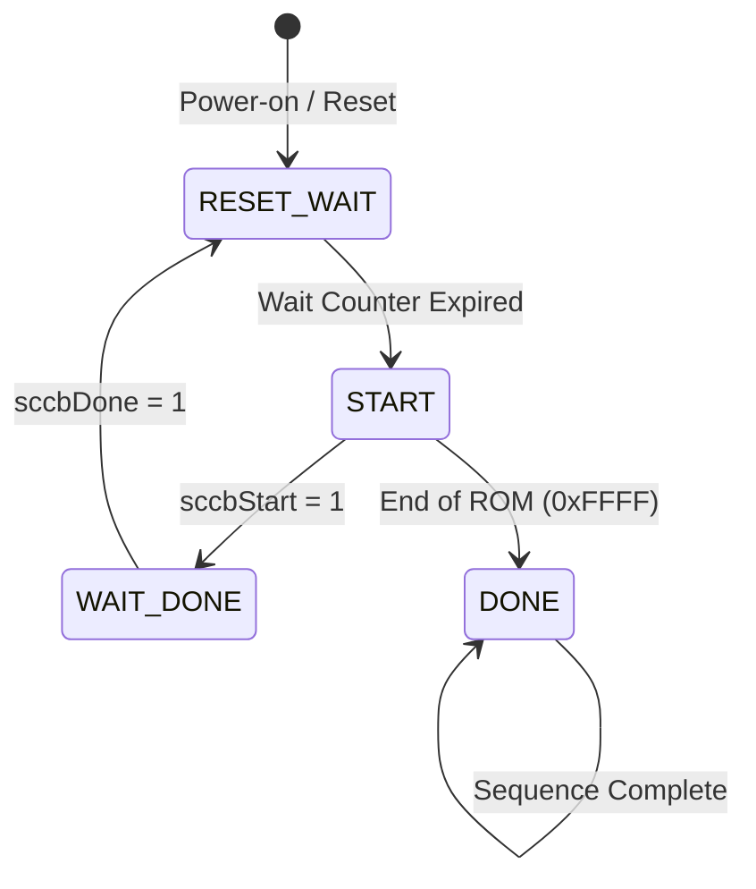
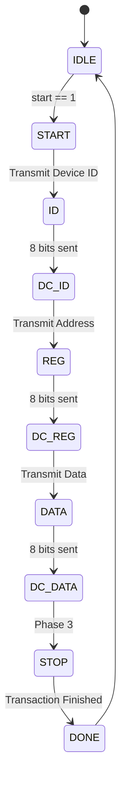
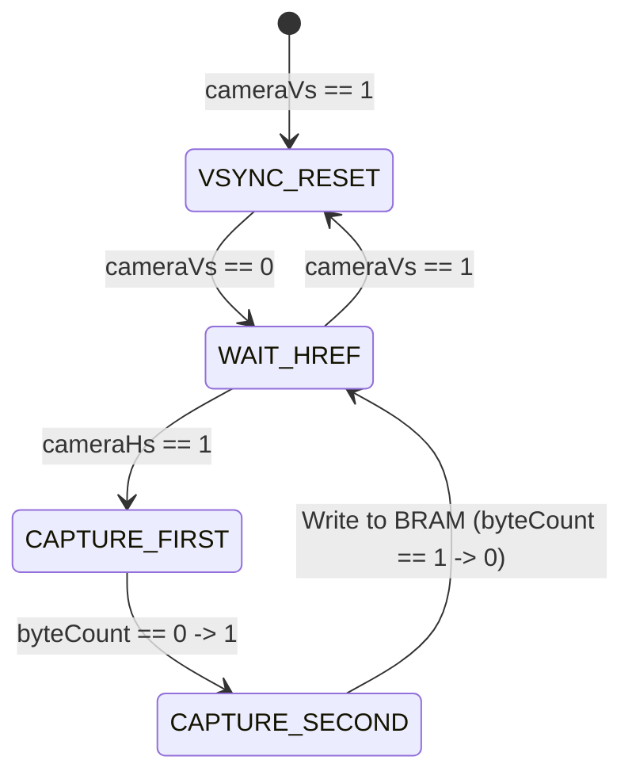

# Verilog Source Files

This directory contains the core Verilog modules for the Basys 3 OV7670 video pipeline.

## 📄 Module Overview

| File | Description | State Machine |
| :--- | :--- | :--- |
| **`topModule.v`** | System top-level integration. | Power-on Reset Counter |
| **`cameraConfig.v`** | Camera register sequencer. | 4-state ROM sequencer |
| **`cameraCapture.v`** | Pixel reconstruction logic. | Sync-based byte toggle |
| **`vgaController.v`** | VGA timing & BRAM interface. | Synchronous counters |
| **`filter.v`** | Real-time image processing. | Combinational |
| **`sccbMaster.v`** | Bit-banged SCCB protocol. | 10-state I2C master |
| **`pulseSync.v`** | Clock Domain Crossing (CDC). | 3-state handshake |

---

## 🕹️ State Machines

### 1. Camera Configuration (`cameraConfig.v`)
This FSM iterates through the ROM and triggers SCCB transactions for each register.

### 2. SCCB Master (`sccbMaster.v`)
A detailed 10-state FSM that handles the bit-level timing of the SCCB protocol.

### 3. Camera Capture Logic (`cameraCapture.v`)
While primarily driven by control signals, it uses a toggle state to handle the two-byte pixel format.

---

## 🏗 System Integration
The design uses a dual-port **Block RAM (BRAM)** as a frame buffer to decouple the camera's write clock (`pClk`) from the VGA's read clock (`vgaClk`).
